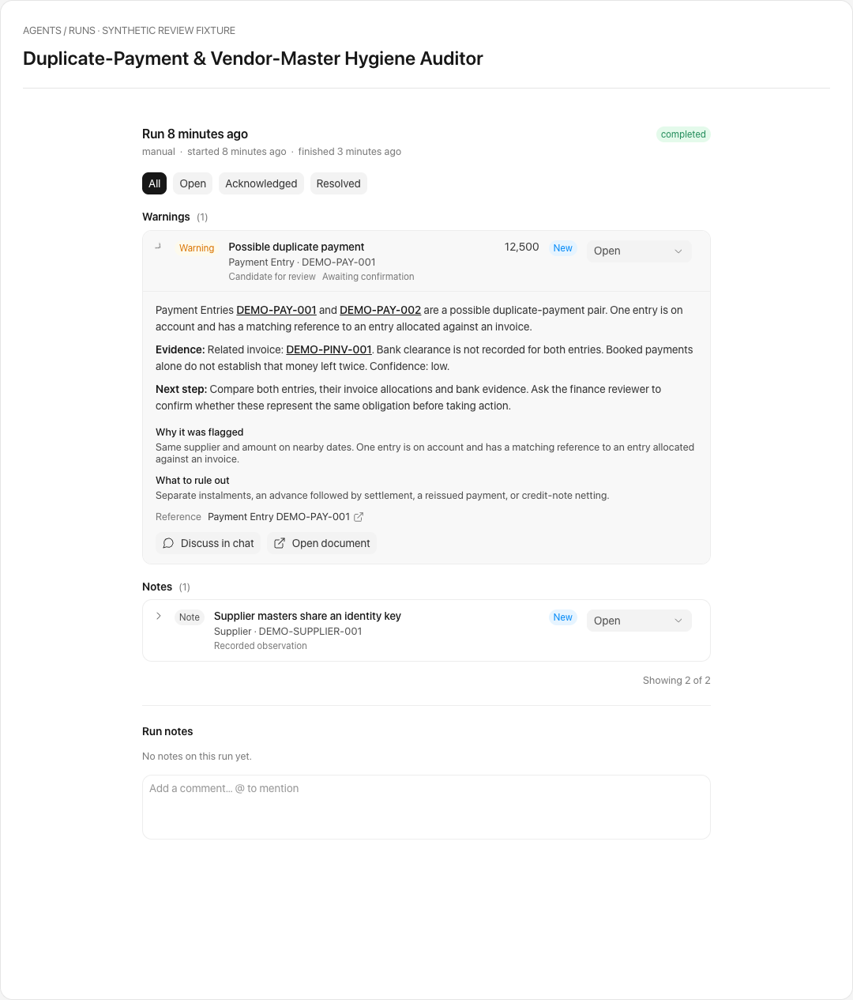

# Agent finding explanations

The evaluator owns the finding's meaning. A delegate forwards its output; the
bench persists it; the Runs view presents it without inferring missing evidence.

## Output contract

Each finding should include a short, human-readable `title` and an evaluator-authored
`note`. The note explains what was observed, links the relevant documents, states
any uncertainty, and gives the reviewer a next step. Candidate findings retain
`result_class`, `match_basis`, `false_positive_path`, and their confirmation status.
Qualitative findings use `amount: null`; no amount is inferred from their severity.

For the Duplicate-Payment & Vendor-Master Hygiene Auditor, fixed templates in the
private evaluator cover payments, purchase invoices, supplier clusters, bank-change
timelines, and tax-data quality. Pair explanations identify both documents. Supplier,
tax, and bank field values remain private; explanations contain document references
and the kind of issue, never the compared field values. Candidates remain unconfirmed.

## Persistence and older runs

`finding_presentation.finding_text` preserves an authored title and full note.
Older bundles that provide only `note` or `detail` still work. Missing titles fall
back to the first explanation line, then to a neutral document reference.

The findings API applies the same fallback on read without changing stored history.
An empty explanation remains empty: the UI discloses the missing explanation and
shows any recorded matching evidence. A subsequent run may fill an open finding's
missing explanation using the evaluator's newly supplied note. Recurrence keeps
the same finding identity, and an existing explanation is never overwritten.

## Runs view

Collapsed rows show a wrapping title, document identity, result class, confirmation
status, and triage controls. Expanded rows show the explanation, why it was flagged,
what to rule out, and document/chat actions. Markdown paragraph boundaries survive
technical-token extraction. Structured metadata renders as escaped text.

The current Currency field stores omitted amounts as zero, so the worklist omits
zero amount badges instead of presenting them as measured financial exposure.
The fallback dashboard distinguishes an omitted amount from an explicit zero.

## Example

The real findings component rendered with synthetic records (no customer data):

## Validation and rollout

Regression tests cover all five evaluator classes, both sides of paired evidence,
privacy, determinism, missing legacy content, recurrence repair, and UI rendering.
Deploy the Jarvis backend/frontend and publish the updated private agent bundle
together. Refresh the agent installation's bundle and rerun the auditor to populate
missing explanations. No schema migration or bulk rewrite of historical findings
is required.
