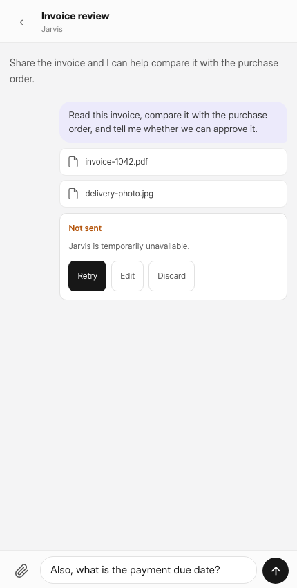
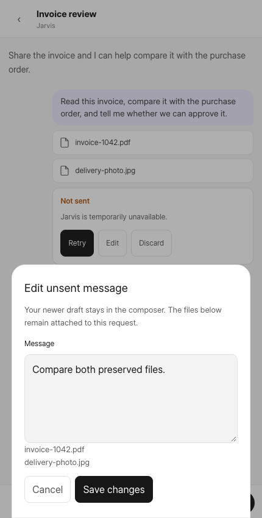
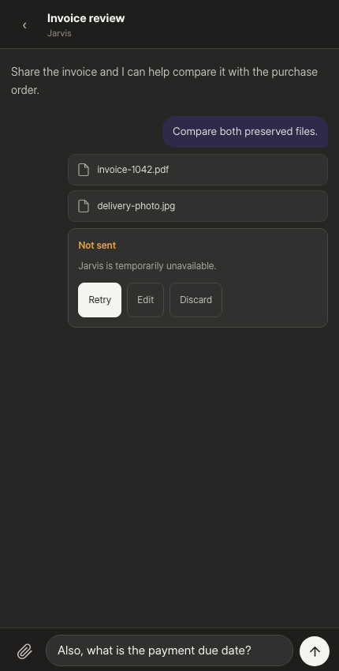
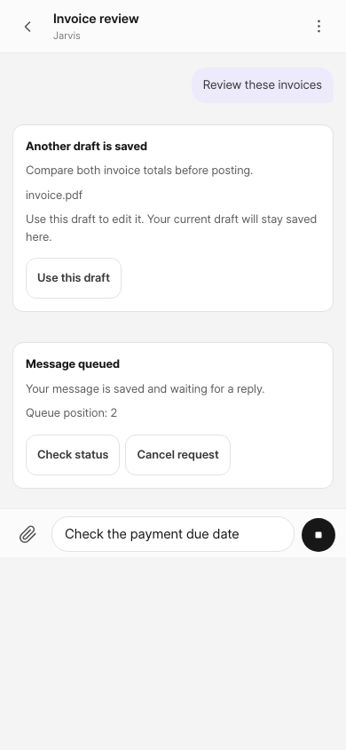
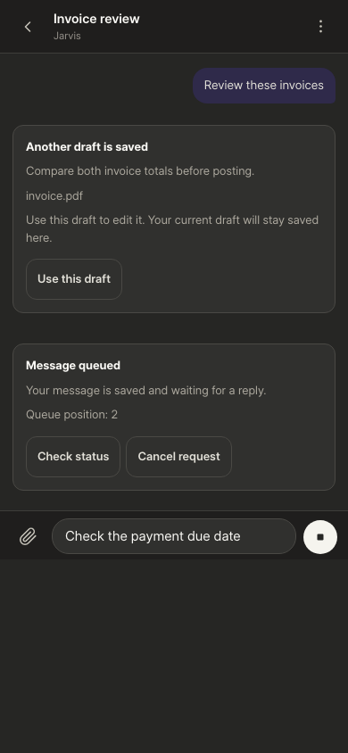

# Conversation send recovery

`ChatView` preserves each outgoing request separately from the server transcript and composer draft. The snapshot includes text, uploaded file URLs/names, the originating conversation and the displayed approval-token order. In-app route changes retain requests and drafts in memory. Reloading, closing the tab, or signing out clears them; this feature is not a persistent offline outbox. The new-chat hero retains its existing send behavior.

Confirmed rejections offer Retry, Edit and Discard. Editing uses a separate modal editor and never replaces a newer composer draft. Retrying allocates a new request ID and reuses all files and the original displayed token order; it does not reselect numbered approval targets. The server's existing unnumbered approval-sweep semantics remain unchanged. Discard removes the local request, not uploaded files or accepted work.

An exception, malformed response, or a POST still pending after 30 seconds becomes Delivery not confirmed. Check delivery only reads `jarvis.chat.pwa_send.check_delivery`; it cannot execute a second send. Late responses cannot overwrite a newer retry or downgrade an already settled result. Delivery reads have a 15-second deadline; timeout unlocks Check delivery without permitting replay, and late read results cannot affect a subsequent check. Normal acceptance is reconciled by the exact returned message ID, never by matching text. Typed confirmations are handled before ordinary ok:false rejection because they can execute without a user-message row or new turn.

If a stale conversation is retargeted to another chat, its destination composer is preserved. A colliding source draft appears in a saved-draft card; Use this draft swaps it with the composer, preserving text and files on both sides. It never sends a request or transfers approval tokens.

Queue feedback is separate from transcript reconciliation. Once a saved user message replaces its local recovery card, an accepted queued turn keeps its status and composer lock. Existing owner-checked admission endpoints discover queued/preparing/ready turns on open, focus and resync, and poll a pending run every 10 seconds. Reads are bounded and fenced against navigation and lifecycle events. Cancellation uses `cancel_queued_turn`; lost responses keep the status and offer a read-only status check. Matching start/terminal events retire queue feedback. Unknown states and failed reads retain the last known status.

## Backend contract and limits

The PWA conversation screen calls `jarvis.chat.pwa_send.send_message`. It keeps the existing send endpoint's gates and behavior, adding a site/user-scoped random-ID claim and a seven-day Redis outcome receipt. Claiming is atomic. Reuse of a retained ID never executes the send twice; a changed payload cannot reuse its outcome. Commit finishes before publishing the receipt. Stored fields exclude request text, attachments and tool results. Delivery lookup rechecks access and ownership.

This is a temporary outcome lookup, not a durable idempotency ledger. Pending, unavailable, evicted and expired receipts all mean unknown, never rejection. No automatic replay or fallback to the legacy endpoint is permitted after an uncertain result. If lookup cannot establish the outcome, the user must inspect the conversation or seek support; the UI keeps the request and does not claim a timeout rolled back business work. Independent file access/extraction failures after acceptance still use the existing tool/file error paths.

## Deployment and verification

Deploy backend before the new PWA bundle. No schema migration is required. Roll back the client first; other send callers are unchanged. Do not force reload on release-update rejection while the request is held only in tab memory.

- `node --test pwa/src/lib/*.test.js`
- From `frontend`: `npm test -- src/components/PwaSendRecovery.spec.js src/components/PwaChatSendRecovery.spec.js`
- In the bench Python environment with this checkout on PYTHONPATH: `python -m unittest jarvis.tests.test_pwa_send_receipts`
- From `pwa`: `npm run build`

The receipt unit suite mocks Redis and the send boundary. Real ERP actions and Redis outage/restart behavior still require integration validation on a dedicated test site. Component tests use the real recovery card and ChatView with mocked APIs; browser checks should include keyboard focus, Escape, newer-draft preservation, slow HTTP responses and route changes.

## Browser validation captures

Synthetic data in the actual recovery component and composer. Captured while verifying native dialog focus and draft preservation; the final rejection copy also explicitly says the request is preserved in this tab.

| Light | Separate editor | Dark |
|---|---|---|
|  |  |  |

### Review-fix browser captures

Actual ChatView at 390px with synthetic API responses: reversible draft selection, queue status refresh, confirmed cancellation, no horizontal overflow, and no runtime errors. These are not live ERP integration checks.

| Light | Dark |
|---|---|
|  |  |
